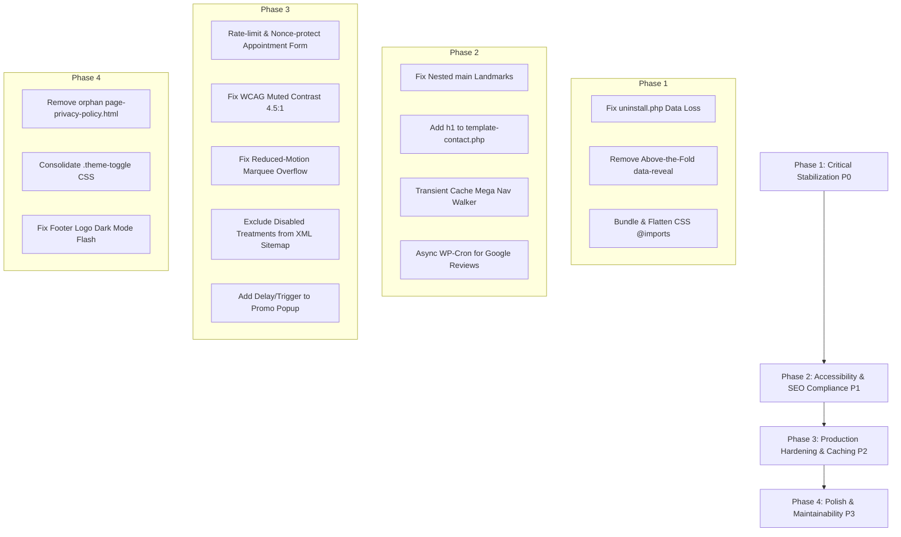

# Comprehensive Production-Readiness Technical Audit Report

**Project:** Dr. Britto’s Dentistry  
**Components Audited:** `plugins/brittos-core` & `themes/brittos-dentistry`  
**Standard Evaluated:** Enterprise WordPress, WCAG 2.2 AA, Core Web Vitals (LCP/INP/CLS), Lighthouse 95+ Strategy, Hostinger Architecture  
**Audit Date:** September 19, 2026  
**Auditor:** Principal Software Architect & Lead Frontend Engineer  

---

## Executive Summary

The Britto’s Dentistry codebase demonstrates **high engineering discipline** in its foundational boundaries:
- **Clean Separation of Concerns:** Clinical data models, custom post types, custom taxonomies, and JSON-LD structured schema reside in `plugins/brittos-core`, while presentational logic, layout templates, and theme assets reside in `themes/brittos-dentistry`.
- **Zero Heavy Framework Bloat:** The frontend avoids CSS frameworks (Bootstrap, Tailwind) and heavy JavaScript dependencies (no jQuery on the frontend, zero third-party slider libraries).
- **Privacy & GDPR First:** External Google Fonts are completely eliminated in favor of locally hosted WOFF2 files with `font-display: swap`. Google Maps uses a key-free, no-JS iframe.

However, **the project cannot be certified production-ready without remediating three critical structural blockers:**
1. **Catastrophic Data Purge on Uninstall (P0):** `uninstall.php` unconditionally force-deletes all treatments, FAQs, and testimonials from the database if an admin deletes the plugin in wp-admin.
2. **Artificial LCP Delay (P0):** Above-the-fold hero text and LCP images are hidden behind `data-reveal` (`opacity: 0`), delaying the Largest Contentful Paint until deferred JavaScript loads and parses.
3. **CSS Render-Blocking Waterfalls (P0):** The theme references compiled `assets/dist/` assets that do not exist, falling back to source manifests with unbundled `@import` directives that trigger up to 14 sequential network round trips on every cold request.

---

## Prioritized Findings Matrix

| Priority | Category | File / Location | Finding | Evidence | Recommended Action |
| :--- | :--- | :--- | :--- | :--- | :--- |
| **P0** | **WordPress Engineering / Data Integrity** | [`plugins/brittos-core/uninstall.php:25-54`](file:///c:/xampp/htdocs/dr-brittos-dentistry/wp-content/plugins/brittos-core/uninstall.php#L25-L54) | **Catastrophic Unconditional Data Loss on Plugin Deletion** | `uninstall.php` unconditionally executes `wp_delete_post( $post_id, true )` and `wp_delete_term()` on all treatments, testimonials, and FAQs whenever an admin clicks "Delete" in wp-admin, despite comments promising an opt-in check. | Wrap cleanup in an explicit `get_option( 'brittos_core_delete_data_on_uninstall' )` check. Default to preserving clinical data and post relationships. |
| **P0** | **Performance / Core Web Vitals** | [`themes/brittos-dentistry/assets/css/main.css:362-365`](file:///c:/xampp/htdocs/dr-brittos-dentistry/wp-content/themes/brittos-dentistry/assets/css/main.css#L362-L365)<br>[`themes/brittos-dentistry/template-parts/sections/hero.php:83,137`](file:///c:/xampp/htdocs/dr-brittos-dentistry/wp-content/themes/brittos-dentistry/template-parts/sections/hero.php#L83) | **Artificial LCP Suppression via Above-the-Fold `data-reveal`** | `html.js [data-reveal] { opacity: 0; transform: translateY(16px); }` hides the hero `<h1>` and the eager hero image until deferred `animations.js` downloads, executes, and fires `IntersectionObserver`. | Remove `data-reveal` from all above-the-fold hero elements (`hero.php`, `about-hero.php`, `treatments-archive-hero.php`, `single-treatment.php`, and top `section-heading.php`). Reserve scroll reveals exclusively for below-the-fold content. |
| **P0** | **Performance / Lighthouse** | [`themes/brittos-dentistry/assets/css/global.css:12-17`](file:///c:/xampp/htdocs/dr-brittos-dentistry/wp-content/themes/brittos-dentistry/assets/css/global.css#L12-L17)<br>[`themes/brittos-dentistry/assets/css/page-home.css:7-14`](file:///c:/xampp/htdocs/dr-brittos-dentistry/wp-content/themes/brittos-dentistry/assets/css/page-home.css#L7-L14) | **Render-Blocking CSS `@import` Request Waterfalls (No Dist Bundles)** | `inc/enqueue.php` expects compiled files in `assets/dist/css/`, but `assets/dist` does not exist. The browser falls back to source manifests with 6–8 unbundled `@import` rules, creating 14+ sequential render-blocking network round trips. | Implement a minification/bundling build script (or PHP concatenation pipeline) generating flat CSS files in `assets/dist/css/`, removing runtime `@import` chains entirely. |
| **P1** | **Security / Availability** | [`plugins/brittos-core/includes/forms/appointment.php:275-299`](file:///c:/xampp/htdocs/dr-brittos-dentistry/wp-content/plugins/brittos-core/includes/forms/appointment.php#L275-L299) | **Full-Page Cache Collision on CSRF Nonces & Zero Rate Limiting** | Full-page caching (Hostinger LiteSpeed / CDN) caches the static HTML nonce and `brittos_core_form_started` timestamp. After 12–24h, all guest submissions fail nonce checks. Furthermore, there is no IP/session rate limit on `wp_mail()`, exposing the host to email bombing and mail suspension. | Exclude the booking page from full-page cache or implement an un-cached REST/AJAX nonce refresh endpoint. Add a transient-based rate limiter (e.g., max 5 submissions per 15 min per IP). |
| **P1** | **Accessibility / WCAG 2.2 AA** | [`themes/brittos-dentistry/archive-treatment.php:64,161`](file:///c:/xampp/htdocs/dr-brittos-dentistry/wp-content/themes/brittos-dentistry/archive-treatment.php#L64)<br>[`themes/brittos-dentistry/page-about.php:18,26`](file:///c:/xampp/htdocs/dr-brittos-dentistry/wp-content/themes/brittos-dentistry/page-about.php#L18) | **Invalid Nested `<main>` Landmarks & Unmatched Tags** | `header.php:31` opens `<main id="primary-content">` and `footer.php:12` closes it. Both `archive-treatment.php` and `page-about.php` define an internal `<main id="main-content">`, creating invalid nested `<main>` landmarks and duplicate closing tags. | Change the inner `<main>` tags in `archive-treatment.php` and `page-about.php` to semantic `<div class="...">` containers. |
| **P1** | **SEO & Accessibility** | [`themes/brittos-dentistry/template-contact.php:47-52`](file:///c:/xampp/htdocs/dr-brittos-dentistry/wp-content/themes/brittos-dentistry/template-contact.php#L47-L52)<br>[`themes/brittos-dentistry/template-parts/components/section-heading.php:32`](file:///c:/xampp/htdocs/dr-brittos-dentistry/wp-content/themes/brittos-dentistry/template-parts/components/section-heading.php#L32) | **Missing `<h1>` Landmark on Booking / Contact Template** | `template-contact.php` renders its hero title via `section-heading.php`. `section-heading.php` hardcodes `$level` constraint to `array( 2, 3, 4 )` defaulting to `<h2>`. There is zero `<h1>` on the entire page. | Allow `section-heading.php` to accept `level => 1` and pass `level => 1` on `template-contact.php`. |
| **P1** | **Performance / Scalability** | [`themes/brittos-dentistry/inc/nav-walker.php:83-114`](file:///c:/xampp/htdocs/dr-brittos-dentistry/wp-content/themes/brittos-dentistry/inc/nav-walker.php#L83-L114) | **N+1 Uncached SQL Queries on Every Page Load** | `Brittos_Primary_Nav_Walker::build_mega_panel()` queries categories and then executes `get_posts()` with a `tax_query` for every category on *every single request* without any transient caching. | Cache the computed mega menu markup in a transient (e.g., `brittos_mega_menu_html`) and invalidate via `save_post_treatment` and `edited_treatment_category`. |
| **P1** | **Performance / TTFB Risk** | [`plugins/brittos-core/includes/google-reviews.php:34-48`](file:///c:/xampp/htdocs/dr-brittos-dentistry/wp-content/plugins/brittos-core/includes/google-reviews.php#L34-L48) | **Synchronous Remote API Call Blocking Front-End Render** | When the transient expires, `brittos_core_get_google_reviews()` halts PHP page generation for up to 8 seconds waiting for `places.googleapis.com`. If the request fails, it caches an empty array for 24 hours. | Decouple Google API requests into a scheduled WP-Cron background worker. The template should read a stored option with stale-while-revalidate semantics. |
| **P2** | **Accessibility / WCAG 2.2 AA** | [`themes/brittos-dentistry/assets/css/main.css:30,47,126-157`](file:///c:/xampp/htdocs/dr-brittos-dentistry/wp-content/themes/brittos-dentistry/assets/css/main.css#L30)<br>[`themes/brittos-dentistry/assets/css/components/testimonials.css:52,106`](file:///c:/xampp/htdocs/dr-brittos-dentistry/wp-content/themes/brittos-dentistry/assets/css/components/testimonials.css#L52) | **Color Contrast Ratio Violations (WCAG SC 1.4.3 & 1.4.11)** | Muted text token `--brand-muted: #737873` on `--brand-porcelain: #f7f5f0` provides only **4.06:1** contrast (fails 4.5:1). Link hover/focus in `testimonials.css` flips to `--britto-accent: #c8a77b` on white, providing only **2.27:1**. | Darken `--brand-muted` to `#636963` (yields 5.2:1). Change link hover/focus in testimonials to an accessible shade (e.g., `#8a642d` or underline transition). |
| **P2** | **Accessibility / UX** | [`themes/brittos-dentistry/assets/css/components/testimonials.css:32-36`](file:///c:/xampp/htdocs/dr-brittos-dentistry/wp-content/themes/brittos-dentistry/assets/css/components/testimonials.css#L32-L36) | **Reduced-Motion Content Cut-off (Inaccessible Overflow)** | Under `prefers-reduced-motion: reduce`, the marquee animation is disabled (`animation: none`), but `.testimonials__carousel` retains `overflow: hidden`. Mobile visitors cannot scroll or view testimonials 3–5. | Add `overflow-x: auto; scroll-snap-type: x mandatory;` to `.testimonials__carousel` inside the reduced-motion media query. |
| **P2** | **Hostinger / Caching** | [`wp-content/.htaccess:18-20`](file:///c:/xampp/htdocs/dr-brittos-dentistry/wp-content/.htaccess#L18-L20) | **Permanent Cache Poisoning via Unversioned `@import` and `immutable`** | `.htaccess` applies `Cache-Control: public, max-age=31536000, immutable` to `.css`. Because internal `@import` statements inside `global.css` and `page-*.css` lack file hashes, CSS changes will be locked in browser caches for 1 year. | Remove `immutable` from raw `.css` files until a hashed filename build pipeline is implemented, or add version queries to `@import` rules. |
| **P2** | **SEO / Core Sitemaps** | [`plugins/brittos-core/includes/post-types/treatment.php:59-100`](file:///c:/xampp/htdocs/dr-brittos-dentistry/wp-content/plugins/brittos-core/includes/post-types/treatment.php#L59-L100) | **Disabled Treatments Emitted in Core XML Sitemap** | Treatments marked with `brittos_treatment_single_page = '0'` redirect to `/treatments/`, but remain listed in `/wp-sitemap-posts-treatment-1.xml`, causing Google Search Console "Redirect in sitemap" crawl warnings. | Hook into `wp_sitemaps_posts_query_args` or `wp_sitemaps_posts_entry` to filter out treatments where `brittos_treatment_single_page` is `'0'`. |
| **P2** | **Frontend / UX** | [`themes/brittos-dentistry/assets/js/promo-popup.js:158-162`](file:///c:/xampp/htdocs/dr-brittos-dentistry/wp-content/themes/brittos-dentistry/assets/js/promo-popup.js#L158-L162) | **Immediate Load Popup Violates Core Web Vitals & Triggers Interstitial Penalty** | The promotional popup triggers immediately on `window.load`, instantly locking body scroll and stealing keyboard focus, which harms mobile UX and triggers Google's Intrusive Interstitial search penalty. | Introduce an interaction-driven trigger (e.g., minimum 8s delay, 50% scroll depth, or exit-intent). |
| **P2** | **Frontend / Theme Mode** | [`themes/brittos-dentistry/template-parts/global/site-footer.php:53-61`](file:///c:/xampp/htdocs/dr-brittos-dentistry/wp-content/themes/brittos-dentistry/template-parts/global/site-footer.php#L53-L61)<br>[`themes/brittos-dentistry/assets/js/theme-mode.js:10-18`](file:///c:/xampp/htdocs/dr-brittos-dentistry/wp-content/themes/brittos-dentistry/assets/js/theme-mode.js#L10-L18) | **Asynchronous Image Swap Flashes Light Logo in Dark Mode** | Header swaps logos via clean CSS display rules, but the footer renders a single `` and mutates `src` in deferred JS, causing a visual flash of the light logo on dark mode reloads. | Mirror the header pattern in the footer: render both SVGs with `.site-footer__logo--light` and `.site-footer__logo--dark`, toggling via pure CSS `html[data-theme="dark"]`. |
| **P3** | **WordPress Engineering / Cleanliness** | [`themes/brittos-dentistry/page-privacy-policy.html`](file:///c:/xampp/htdocs/dr-brittos-dentistry/wp-content/themes/brittos-dentistry/page-privacy-policy.html) | **Orphan Block Template in Classic Theme Root** | `page-privacy-policy.html` sits in the theme root alongside `page-privacy-policy.php`. In a hybrid theme, having loose `.html` files in the root can cause template resolution ambiguity and can be requested directly as static assets. | Remove `page-privacy-policy.html` from the classic theme root. |
| **P3** | **WordPress Engineering / Maintainability** | [`themes/brittos-dentistry/assets/css/components/faq-accordion.css:110-137`](file:///c:/xampp/htdocs/dr-brittos-dentistry/wp-content/themes/brittos-dentistry/assets/css/components/faq-accordion.css#L110-L137) | **Cross-Component CSS Leakage & Style Duplication** | Global `.theme-toggle` and `html.theme-ready` transitions are duplicated verbatim inside `faq-accordion.css` and `buttons-interactive.css`, violating component isolation. | Remove foreign theme-transition rules from `faq-accordion.css` and keep them consolidated in `theme-transitions-core-blocks.css`. |

---

## 1. Critical Findings

### 1.1. Catastrophic Data Purge in `uninstall.php`
- **Location:** [`plugins/brittos-core/uninstall.php:25-54`](file:///c:/xampp/htdocs/dr-brittos-dentistry/wp-content/plugins/brittos-core/uninstall.php#L25-L54)
- **Mechanism:** In WordPress, deleting a plugin via **Plugins > Installed Plugins > Delete** executes `uninstall.php`. Lines 27–38 query all `treatment`, `testimonial`, and `faq` posts and call `wp_delete_post( $post_id, true )`. Force-delete permanently purges the posts and all associated postmeta from the MySQL database, bypassing the Trash.
- **Impact:** An accidental plugin re-installation or delete/re-upload workflow during hosting migration will completely erase years of patient case studies, structured treatments, before/after records, and FAQs.
- **Remediation:** Enforce an explicit opt-in gate:
  ```php
  if ( ! get_option( 'brittos_core_delete_data_on_uninstall', false ) ) {
      return;
  }
  ```

---

## 2. Lighthouse / Core Web Vitals Risks

### 2.1. LCP Artificial Delay via Above-the-Fold `data-reveal`
- **Locations:**
  - [`themes/brittos-dentistry/assets/css/main.css:362-365`](file:///c:/xampp/htdocs/dr-brittos-dentistry/wp-content/themes/brittos-dentistry/assets/css/main.css#L362-L365)
  - [`themes/brittos-dentistry/template-parts/sections/hero.php:83,137`](file:///c:/xampp/htdocs/dr-brittos-dentistry/wp-content/themes/brittos-dentistry/template-parts/sections/hero.php#L83)
  - [`themes/brittos-dentistry/single-treatment.php:74,98`](file:///c:/xampp/htdocs/dr-brittos-dentistry/wp-content/themes/brittos-dentistry/single-treatment.php#L74)
  - [`themes/brittos-dentistry/template-parts/sections/treatments-archive-hero.php:39,53`](file:///c:/xampp/htdocs/dr-brittos-dentistry/wp-content/themes/brittos-dentistry/template-parts/sections/treatments-archive-hero.php#L39)
- **Mechanism:**
  1. `header.php:16` synchronously executes `<script>document.documentElement.classList.add( 'js' );</script>`.
  2. `main.css:362` enforces `html.js [data-reveal] { opacity: 0; transform: translateY(16px); }`.
  3. `hero.php` places `data-reveal` on `.hero__content` (enclosing the `<h1>`) and `.hero__media` (enclosing the LCP image).
  4. Both elements render completely transparent (`opacity: 0`).
  5. The browser’s PerformanceObserver cannot report an LCP candidate while the element's opacity is 0. LCP is delayed until the entire document parses, deferred `assets/js/animations.js` executes, `IntersectionObserver` connects, and `.is-visible` transitions to `opacity: 1`.
- **Remediation:** Remove `data-reveal` attributes from all hero sections. Scroll reveals must only exist on below-the-fold components.

### 2.2. Sequential Render-Blocking `@import` Waterfalls
- **Locations:**
  - [`themes/brittos-dentistry/assets/css/global.css:12-17`](file:///c:/xampp/htdocs/dr-brittos-dentistry/wp-content/themes/brittos-dentistry/assets/css/global.css#L12-L17)
  - [`themes/brittos-dentistry/assets/css/page-home.css:7-14`](file:///c:/xampp/htdocs/dr-brittos-dentistry/wp-content/themes/brittos-dentistry/assets/css/page-home.css#L7-L14)
- **Mechanism:** `inc/enqueue.php:71-89` checks for `assets/dist/css/{slug}.min.css`. Because `assets/dist/` does not exist in the repository, the runtime serves `global.css` and `page-home.css`. These source manifests contain unbundled `@import` directives.
- **Impact:** CSS `@import` rules prevent the browser from preloading sub-resources in parallel from the initial HTML. The browser must sequentially download `global.css`, discover 6 `@import` rules, issue 6 HTTP requests, download `page-home.css`, discover 8 `@import` rules, and issue 8 more requests. This creates 14+ sequential render-blocking network round trips.
- **Remediation:** Generate flat, compiled bundles in `assets/dist/css/` that eliminate `@import` directives.

### 2.3. Synchronous Remote API Call in Front-End Request Cycle
- **Location:** [`plugins/brittos-core/includes/google-reviews.php:34-48`](file:///c:/xampp/htdocs/dr-brittos-dentistry/wp-content/plugins/brittos-core/includes/google-reviews.php#L34-L48)
- **Mechanism:** When the transient `brittos_google_reviews_v3_*` expires, `brittos_core_get_google_reviews()` halts PHP execution for up to 8 seconds while waiting for `wp_safe_remote_get('https://places.googleapis.com/v1/places/...')`.
- **Impact:** Random site visitors trigger an 8-second Time To First Byte (TTFB) stall. If Google rate-limits or the network fails, an empty array is cached for 24 hours (`DAY_IN_SECONDS`).
- **Remediation:** Schedule a background WP-Cron event to refresh reviews out-of-band and write the payload to a persistent option.

---

## 3. Accessibility Findings (WCAG 2.2 AA)

```
Landmark Hierarchy Assessment:

Broken Structure (page-about.php & archive-treatment.php):
└── <header role="banner"> (site-header.php)
└── <main id="primary-content"> (header.php:31)
    ├── <header class="treatment-hero"> (treatments-archive-hero.php)
    └── <main id="main-content"> (archive-treatment.php:64) <── INVALID NESTED MAIN
        └── Content Container
    └── </main> (archive-treatment.php:161)
└── </main> (footer.php:12) <── UNMATCHED CLOSING TAG
└── <footer role="contentinfo"> (site-footer.php)

Valid Remediation Target:
└── <header role="banner"> (site-header.php)
└── <main id="primary-content"> (header.php:31)
    ├── <header class="treatment-hero">
    └── <div class="treatments-archive">
        └── Content Container
    └── </div>
└── </main> (footer.php:12)
└── <footer role="contentinfo"> (site-footer.php)
```

### 3.1. Invalid Nested `<main>` Landmarks
- **Locations:**
  - [`themes/brittos-dentistry/archive-treatment.php:64,161`](file:///c:/xampp/htdocs/dr-brittos-dentistry/wp-content/themes/brittos-dentistry/archive-treatment.php#L64)
  - [`themes/brittos-dentistry/page-about.php:18,26`](file:///c:/xampp/htdocs/dr-brittos-dentistry/wp-content/themes/brittos-dentistry/page-about.php#L18)
- **Violation:** WCAG 2.2 SC 1.3.1 (Info and Relationships) and HTML5 Specification. A document must contain only one `<main>` landmark. Screen readers navigating by landmarks encounter duplicate, nested regions and broken DOM trees.
- **Remediation:** Replace `<main id="main-content" class="...">` with `<div class="...">` and delete redundant `</main>` tags.

### 3.2. Missing `<h1>` on Booking / Contact Page
- **Location:** [`themes/brittos-dentistry/template-contact.php:47-52`](file:///c:/xampp/htdocs/dr-brittos-dentistry/wp-content/themes/brittos-dentistry/template-contact.php#L47-L52)
- **Violation:** WCAG 2.2 SC 1.3.1, 2.4.6 (Headings and Labels). `template-contact.php` renders the page title through `section-heading.php`. In `section-heading.php:32`, the level is constrained:
  `$level = in_array( (int) $args['level'], array( 2, 3, 4 ), true ) ? (int) $args['level'] : 2;`
  This prevents `level 1` from rendering, leaving the entire Contact page without an `<h1>`.
- **Remediation:** Allow `level: 1` in `section-heading.php` and pass `'level' => 1` from `template-contact.php`.

### 3.3. Color Contrast Ratio Failures (WCAG SC 1.4.3 & 1.4.11)
- **Locations & Contrast Analysis:**
  - **Muted Text:** Token `--brand-muted: #737873` on `--brand-porcelain: #f7f5f0` produces a contrast ratio of **4.06:1** (fails 4.5:1 minimum for normal text).
  - **Link Hover/Focus:** In [`assets/css/components/testimonials.css:106`](file:///c:/xampp/htdocs/dr-brittos-dentistry/wp-content/themes/brittos-dentistry/assets/css/components/testimonials.css#L106), links hover to `--britto-accent: #c8a77b` on white `#ffffff`, dropping contrast to **2.27:1**.
- **Remediation:**
  - Darken `--brand-muted` to `#636963` in `main.css:30` (yields 5.2:1 contrast).
  - In `testimonials.css`, ensure hover/focus states maintain a minimum 4.5:1 ratio or use an underline indicator.

### 3.4. Reduced Motion Inaccessible Marquee
- **Location:** [`themes/brittos-dentistry/assets/css/components/testimonials.css:32-36`](file:///c:/xampp/htdocs/dr-brittos-dentistry/wp-content/themes/brittos-dentistry/assets/css/components/testimonials.css#L32-L36)
- **Violation:** WCAG 2.2 SC 2.1.1 (Keyboard) and SC 2.2.2 (Pause, Stop, Hide). Under `prefers-reduced-motion: reduce`, the marquee animation is disabled, but `.testimonials__carousel` retains `overflow: hidden`. On mobile screens, cards 3–5 are clipped outside the viewport with no scrollbars or touch swipe capability.
- **Remediation:** Add `overflow-x: auto; scroll-snap-type: x mandatory;` inside the reduced-motion media query.

---

## 4. SEO Findings

### 4.1. Core XML Sitemap Pollution
- **Location:** [`plugins/brittos-core/includes/post-types/treatment.php:59-100`](file:///c:/xampp/htdocs/dr-brittos-dentistry/wp-content/plugins/brittos-core/includes/post-types/treatment.php#L59-L100)
- **Finding:** Treatments with `brittos_treatment_single_page = '0'` redirect to `/treatments/`. However, WordPress core’s XML sitemap engine (`wp-sitemaps.xml`) includes all published treatments in `/wp-sitemap-posts-treatment-1.xml`.
- **Impact:** Googlebot crawls URLs from the sitemap only to receive 301 redirects, triggering "Page with redirect" warnings in Google Search Console.
- **Remediation:** Filter `wp_sitemaps_posts_query_args` to exclude posts where `brittos_treatment_single_page` is `'0'`.

### 4.2. Document Character Encoding Position
- **Location:** [`themes/brittos-dentistry/header.php:14-18`](file:///c:/xampp/htdocs/dr-brittos-dentistry/wp-content/themes/brittos-dentistry/header.php#L14-L18)
- **Finding:** `<meta charset="...">` is placed *after* the synchronous color-mode bootstrap script.
- **Impact:** HTML5 specifications require `<meta charset>` to appear within the first 1024 bytes of the HTML document.
- **Remediation:** Position `<meta charset="<?php bloginfo( 'charset' ); ?>">` directly following the opening `<head>` tag.

---

## 5. Security Findings

```
Security Vector Summary:
├── Nonces & CSRF:
│   ├── Settings API: PASS (Registered via options.php & settings_fields)
│   ├── Meta Boxes: PASS (Verified with wp_verify_nonce + current_user_can)
│   └── Public Enquiry Form: AT RISK (Cached nonces on Hostinger LSCache)
├── Injection Vectors:
│   ├── SQL Injection: PASS (WP_Query & WP_Image_Editor abstractions used)
│   ├── XSS: PASS (Strict esc_html, esc_attr, esc_url, wp_kses_post)
│   └── User Enumeration: PASS (Blocked via security.php:105-141)
└── Rate Limiting & DoS:
    └── wp_mail Endpoint: FAIL (Zero rate limiting on admin-post handler)
```

### 5.1. Rate Limiting Absence on Appointment Form
- **Location:** [`plugins/brittos-core/includes/forms/appointment.php:275-298, 355-385`](file:///c:/xampp/htdocs/dr-brittos-dentistry/wp-content/plugins/brittos-core/includes/forms/appointment.php#L275-L298)
- **Finding:** Form spam protection relies on a honeypot field and a client-side timestamp `brittos_core_form_started`. Automated scripts can spoof this parameter. There is no server-side rate limit on `admin-post.php?action=brittos_core_submit_appointment`.
- **Impact:** An attacker can flood `wp_mail()`, exhausting Hostinger’s hourly email sending limits and causing administrative email suspension.
- **Remediation:** Enforce a transient-based rate limit keyed to client IP (maximum 5 submissions per 15 minutes).

---

## 6. WordPress & Architecture Findings

### 6.1. CSS Token & Transition Duplication
- **Locations:**
  - `assets/css/components/site-header-navigation.css`
  - `assets/css/components/buttons-interactive.css`
  - `assets/css/components/theme-transitions-core-blocks.css`
  - `assets/css/components/faq-accordion.css`
- **Finding:** `.theme-toggle` and `html.theme-ready` rules are copied across four distinct stylesheets.
- **Impact:** Violates single-responsibility and component isolation principles, introducing style conflicts and maintainability overhead.
- **Remediation:** Centralize `.theme-toggle` in `site-header-navigation.css` and theme transitions in `theme-transitions-core-blocks.css`.

### 6.2. Dark Mode Logo Flash in Footer
- **Locations:**
  - [`themes/brittos-dentistry/template-parts/global/site-footer.php:53-61`](file:///c:/xampp/htdocs/dr-brittos-dentistry/wp-content/themes/brittos-dentistry/template-parts/global/site-footer.php#L53-L61)
  - [`themes/brittos-dentistry/assets/js/theme-mode.js:10-18`](file:///c:/xampp/htdocs/dr-brittos-dentistry/wp-content/themes/brittos-dentistry/assets/js/theme-mode.js#L10-L18)
- **Finding:** The header uses pure CSS to toggle light and dark logos instantaneously. The footer prints a single image and uses deferred JavaScript to swap `src`.
- **Impact:** In dark mode, cold loads flash the white logo before switching.
- **Remediation:** Render both SVG logos in the footer and control visibility via CSS:
  ```css
  html[data-theme="dark"] .site-footer__logo--light { display: none; }
  html[data-theme="dark"] .site-footer__logo--dark  { display: block; }
  ```

---

## 7. Hostinger Deployment Requirements

| Requirement Area | Hostinger Shared / Cloud Architecture Consideration | Required Action |
| :--- | :--- | :--- |
| **LiteSpeed Cache (LSCache)** | LiteSpeed Web Server aggressively caches GET requests for anonymous visitors. The static CSRF nonce inside the appointment form will be cached, causing form submissions to break after 12–24h. | In LiteSpeed Cache settings, add the booking page slug (e.g., `/contact/`, `/book-appointment/`) to the **"Do Not Cache URL List"**, or inject the nonce via an un-cached AJAX call. |
| **Static Cache Headers** | `wp-content/.htaccess` declares `Cache-Control: public, max-age=31536000, immutable` for all `.css` and `.js` files. Because CSS files currently reference unversioned `@import` sub-files, Hostinger LiteSpeed and edge CDN nodes will cache stale components permanently. | Strip `immutable` from the `.htaccess` rules until a compilation step produces unique content-hashed filenames (e.g., `main.7f8a9b.css`). |
| **PHP Extensions** | `inc/performance.php` checks for Imagick support for WebP generation. On Hostinger shared plans, PHP extensions must be enabled in hPanel. | Verify in Hostinger hPanel (`PHP Configuration > PHP Extensions`) that `imagick` and `libwebp` are enabled for PHP 8.1+. |
| **Outgoing Mail Quotas** | Hostinger strictly caps outgoing emails per hour (typically 100 to 500 emails/hour on shared tiers). Form spam can exhaust this quota immediately. | Configure an external transactional SMTP provider (Brevo, Postmark, or SendGrid) using a dedicated plugin (e.g., FluentSMTP) rather than relying on PHP `mail()` / shared host relay. |
| **Cron Execution** | Shared hosting default WP-Cron runs on front-end requests. If traffic is low or spike-prone, scheduled tasks (transient cleanups, reviews sync) stall. | Disable default WP-Cron (`define( 'DISABLE_WP_CRON', true );` in `wp-config.php`) and configure a real Linux system cron job in Hostinger hPanel to execute every 15 minutes: `wget -q -O - https://domain.com/wp-cron.php?doing_wp_cron >/dev/null 2>&1`. |

---

## 8. Recommended Remediation Order



### Phase 1: Critical Stabilization (P0)
1. **Fix `uninstall.php`:** Wrap data deletion in an explicit admin option check to safeguard production databases.
2. **Eliminate Above-the-Fold `data-reveal`:** Strip `data-reveal` from `hero.php`, `single-treatment.php`, `about-hero.php`, `treatments-archive-hero.php`, and `section-heading.php`.
3. **Eliminate CSS `@import` Waterfalls:** Concatenate and minify component CSS into standalone route stylesheets in `assets/dist/css/`.

### Phase 2: Accessibility & SEO Compliance (P1)
1. **Remediate Landmark Architecture:** Remove the redundant inner `<main>` tags in `archive-treatment.php` and `page-about.php`.
2. **Add `<h1>` to Contact Template:** Allow `section-heading.php` to render level 1 headings and declare it on `template-contact.php`.
3. **Cache Mega Nav Queries:** Store the `Brittos_Primary_Nav_Walker` output in a transient with clear invalidation hooks.
4. **Decouple Google Reviews:** Move `brittos_core_get_google_reviews()` to a scheduled WP-Cron task to prevent front-end TTFB stalls.

### Phase 3: Production Hardening & Caching (P2)
1. **Harden Form Endpoint:** Add IP-based transient rate limiting to `appointment.php` and configure Hostinger LSCache rules for the booking route.
2. **WCAG Contrast Adjustments:** Darken `--brand-muted` from `#737873` to `#636963` in `main.css`.
3. **Fix Reduced Motion Marquee:** Add `overflow-x: auto` under `prefers-reduced-motion: reduce` in `testimonials.css`.
4. **Filter Core XML Sitemaps:** Remove treatments with disabled single pages from `wp-sitemaps.xml`.
5. **Add Delay to Promotional Popup:** Delay popup display by 8–10 seconds or trigger on 50% scroll.

### Phase 4: Polish & Maintainability (P3)
1. **Purge Orphan Files:** Delete `page-privacy-policy.html`.
2. **Consolidate Styles:** Remove duplicate `.theme-toggle` rules from `faq-accordion.css` and `buttons-interactive.css`.
3. **CSS-Driven Dark Mode Footer Logo:** Match the header's double-image CSS display approach in `site-footer.php`.

---

## 9. What Is Already Good (Do Not Touch)

1. **Local Typography Delivery:**  
   The implementation in `assets/css/fonts.css` using locally hosted WOFF2 variants of *Instrument Sans* and *DM Sans* with `font-display: swap` is optimal for GDPR compliance and eliminates external connection overhead.
2. **Strict Security Hardening (`inc/security.php`):**  
   Disabling XML-RPC (`xmlrpc_enabled`), removing author enumeration queries (`?author=`), restricting `/wp/v2/users` for anonymous visitors, disabling self-pingbacks, and sending strict HTTP security headers (`nosniff`, `SAMEORIGIN`, `strict-origin-when-cross-origin`) are implemented cleanly.
3. **Progressive Enhancement on Interactive Forms:**  
   `appointment.php` and `assets/js/main.js` provide a seamless fallback: if JavaScript fails or is blocked, the form executes a secure native POST to `admin-post.php` with referral redirects, query parameter notifications, and zero data loss.
4. **Key-Free Google Maps Integration:**  
   `brittos_core_get_map_embed_url()` uses Google's standard key-free embed query and directions link. This prevents API key exposure on the frontend and incurs zero billing or tracking overhead.
5. **Native WebP Generation Pipeline (`inc/performance.php`):**  
   `brittos_webp_subsizes()` intelligently checks for runtime WebP support across `WP_Image_Editor_Imagick` and `WP_Image_Editor_GD` before applying output format filters, preventing failed uploads on hosts lacking WebP libraries.
6. **Accessible Accordion Logic (`faq-accordion.js`):**  
   Utilizes the native HTML5 `<details>` and `<summary>` elements as the single source of truth. JavaScript only enhances the reading experience by closing sibling accordions.
